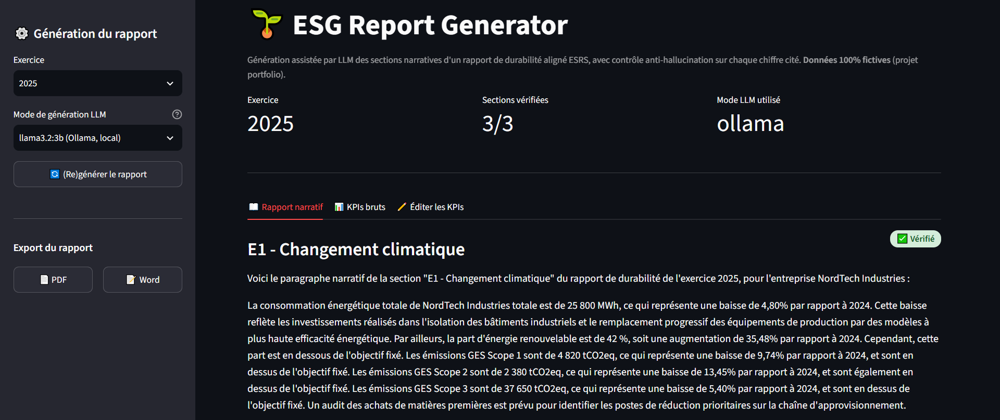
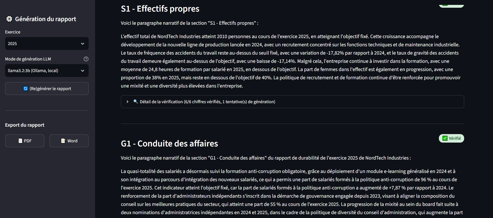
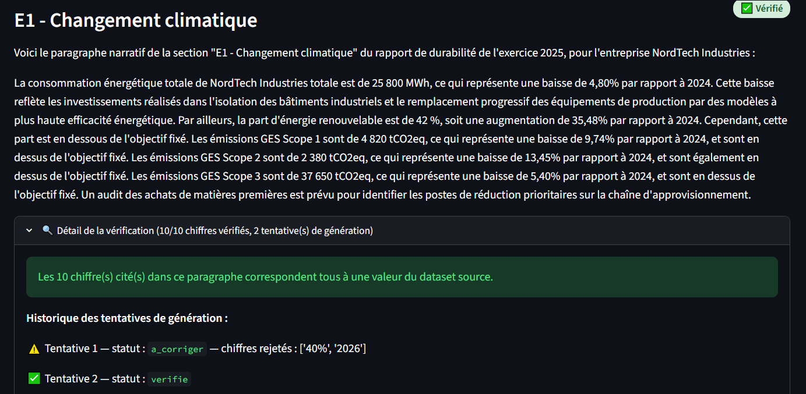

# 🌱 ESG Report Generator

Génération automatisée des sections narratives d'un rapport de durabilité
(ESRS), à partir de KPIs ESG structurés avec un contrôle anti-hallucination
déterministe qui vérifie que chaque chiffre cité dans le texte généré
correspond réellement à une donnée source.

**Projet portfolio / démo.** Toutes les données (entreprise "NordTech Industries", KPIs, contexte qualitatif) sont fictives.
Le mapping ESRS est simplifié à des fins pédagogiques (voir `docs/esrs_reference_notes.md`).

---

## Pourquoi ce projet

La CSRD (Corporate Sustainability Reporting Directive) impose à un nombre
croissant d'entreprises européennes de produire des rapports de durabilité
détaillés, structurés selon les normes ESRS. Ce reporting est aujourd'hui
largement rédigé manuellement par les équipes RSE/finance, à partir de tableurs
de KPIs, un exercice répétitif, chronophage, et propice aux formulations peu
homogènes d'une section à l'autre.

La génération assistée par LLM peut accélérer ce travail (premier jet de
rédaction, harmonisation du ton, structuration selon la taxonomie), mais
un LLM peut halluciner des chiffres, un risque inacceptable dans un document
qui engage la responsabilité de l'entreprise et qui peut faire l'objet d'un
audit externe (assurance CSRD).

Le point différenciant de ce projet n'est donc pas la génération de texte
en elle-même, mais le garde-fou qui rend cette génération exploitable en
contexte réglementaire : chaque chiffre cité dans un paragraphe généré est
extrait et comparé, de façon déterministe, à l'ensemble des valeurs
réellement présentes dans le dataset source. Un chiffre non retrouvé déclenche
une régénération automatique, puis, si le problème persiste, un flag
explicite pour revue humaine. Rien n'est jamais publié comme "vérifié" sans
l'avoir été réellement.

---

## Architecture

```
data/raw/                          Dataset ESG fictif (KPIs, contexte, mapping ESRS)
        │
        ▼
dataiku_flow/                      Pipeline de données (flow Dataiku, exécutable en local)
  01_nettoyage_kpis.py               Typage, dédoublonnage, contrôles de cohérence
  02_calcul_yoy_et_ecarts.py         Variation YoY, écart vs objectif, statut
  03_mapping_esrs.py                 Jointure mapping ESRS + contexte qualitatif
        │
        ▼
data/processed/kpis_enrichis.csv   Dataset final (KPIs + mapping + contexte)
        │
        ▼
generation/                        Génération narrative par section ESRS (Ollama / LLM Mesh / mode démo)
  generate_sections.py               Construction du prompt, appel LLM
        │
        ▼
verification/                      🛡️ Contrôle anti-hallucination
  number_extractor.py                Extraction déterministe des chiffres (regex)
  cross_checker.py                   Comparaison vs valeurs sources autorisées
  regeneration.py                    Boucle de régénération + flag revue humaine
        │
        ▼
generate_report.py                 Orchestrateur : génère + vérifie les 3 sections, écrit rapport_final.json
        │
        ▼
app/streamlit_app.py               Dashboard : KPIs, texte généré, badges ✅/⚠️, export PDF/Word
```

---

## Le mécanisme anti-hallucination, en détail

### 1. Extraction déterministe des chiffres (`number_extractor.py`)

Un parseur regex, **pas un second appel LLM**, extrait tous les nombres du
texte généré : entiers, décimaux (point ou virgule), pourcentages, avec ou
sans séparateur de milliers. Le choix d'un extracteur déterministe plutôt
qu'un "LLM qui se relit" est volontaire : un juge non-déterministe pourrait
lui-même halluciner sur ce qu'il a "vu" dans le texte. **La détection doit
être 100% reproductible : même texte → même résultat, toujours.**

Deux garde-fous contre les faux positifs :
- Les années citées en tant que dates (« en 2025 », « depuis 2023 ») ne sont
  pas traitées comme des valeurs de KPI.
- Les chiffres qui font partie du *nom* d'un indicateur (ex. « Scope 1 »,
  « Scope 2 ») sont neutralisés avant extraction, pour ne pas être confondus
  avec une valeur mesurée.

### 2. Cross-check contre les valeurs sources (`cross_checker.py`)

Chaque chiffre extrait est comparé (à une tolérance de ±0.05 en absolu ou
±0.5% en relatif, pour absorber les arrondis d'affichage) à l'ensemble des
valeurs *autorisées* pour la section : valeur courante, valeur N-1, variation
YoY (signée et absolue), objectif, écart à l'objectif. Le verdict est calculé
**en Python pur, sans LLM**, c'est ce qui garantit qu'on a un vrai garde-fou,
et pas simplement un second avis probabiliste.

### 3. Régénération automatique (`regeneration.py`)

Si un ou plusieurs chiffres ne sont pas retrouvés, le prompt est complété
avec la liste exacte des valeurs rejetées et une instruction de correction
explicite, puis la section est régénérée (jusqu'à 3 tentatives). Si l'échec
persiste, la section est marquée `a_corriger` et transmise telle quelle au
dashboard — **jamais republiée silencieusement comme vérifiée**.

### Limite assumée

Le système privilégie les **faux positifs** (sur-signalement) aux **faux
négatifs** (chiffre halluciné non détecté) : par exemple, une reformulation
libre d'un identifiant de périmètre non couverte par les règles de masquage
peut être flaggée à tort. C'est un choix de conception délibéré pour un outil
à vocation réglementaire : mieux vaut une relance humaine superflue qu'une
hallucination publiée sans contrôle.

---

## Installation et exécution

```bash
python -m venv venv && source venv/bin/activate   # ou l'équivalent Windows
pip install -r requirements.txt
cp .env.example .env   # facultatif : rien à renseigner pour mock/ollama, sauf DATAIKU_LLM_ID si vous utilisez Dataiku
```

### 1. Exécuter le pipeline de données (équivalent du flow Dataiku)

```bash
python dataiku_flow/run_pipeline.py
```

### 2. Générer le rapport (avec vérification anti-hallucination)

```bash
# Mode démo, sans clé API (déterministe, pour tester tout le reste du pipeline)
python generate_report.py --annee 2025 --llm-mode mock

# Avec un vrai LLM en local, gratuit, sans clé API (nécessite Ollama installé)
python generate_report.py --annee 2025 --llm-mode ollama --ollama-model llama3.2:3b

# Modèle plus léger, pour une machine moins puissante
python generate_report.py --annee 2025 --llm-mode ollama --ollama-model llama3.2:1b
```

### 3. Lancer le dashboard

```bash
streamlit run app/streamlit_app.py
```

Le dashboard propose 3 onglets :
- **📖 Rapport narratif** : le texte généré par section, avec badge ✅/⚠️
- **📊 KPIs bruts** : les indicateurs sous forme de tableau
- **✏️ Éditer les KPIs** : édition interactive des valeurs directement dans
  l'interface. Le CSV source (`data/raw/kpis_esg.csv`) reste la source de
  vérité du projet — cohérent avec un usage réel où les KPIs ESG proviennent
  de systèmes sources (ERP, SIRH, HSE), pas d'une saisie manuelle en
  production — mais cet onglet permet de modifier une valeur, sauvegarder,
  et voir le pipeline de données + la génération + la vérification
  anti-hallucination se relancer automatiquement, pour une démo interactive.
  Seules les colonnes `valeur` et `objectif_seuil` sont éditables ; les
  colonnes structurelles (kpi_id, code ESRS...) restent en lecture seule
  car elles servent de clé de jointure avec le contexte qualitatif et le
  mapping ESRS.

### 4. Lancer les tests

```bash
pytest tests/ -v
```

---

## Modes de génération LLM

| Mode | Description | Prérequis |
|---|---|---|
| `mock` (défaut) | Génération déterministe à partir d'un template Python, n'utilisant que les valeurs du tableau source. Permet de faire tourner tout le projet (pipeline, vérification, dashboard, export) sans aucune clé API. | Aucun |
| `ollama` | Modèle Llama tournant **en local** via [Ollama](https://ollama.com) — gratuit, sans clé API, sans compte. Deux modèles proposés dans le dashboard : `llama3.2:3b` (bon compromis) et `llama3.2:1b` (plus léger, pour une machine modeste). La génération dépend de la puissance de votre machine. | [Ollama](https://ollama.com/download) installé + modèle téléchargé |
| `dataiku` | Appel via LLM Mesh, à exécuter depuis un recipe/notebook Dataiku. | Instance Dataiku + LLM connecté + `DATAIKU_LLM_ID` |

### Utiliser Ollama (Llama en local, sans clé API)

```bash
# 1. Installer Ollama : https://ollama.com/download
# 2. Télécharger un modèle (une seule fois)
ollama pull llama3.2:3b   # ~2 Go, bon compromis qualité/vitesse (recommandé)
ollama pull llama3.2:1b   # ~1.3 Go, pour une machine plus modeste

# 3. Générer le rapport avec le modèle choisi
python generate_report.py --annee 2025 --llm-mode ollama --ollama-model llama3.2:3b
```

Ollama doit être lancé (l'application Ollama ouverte, ou `ollama serve` dans
un terminal) pour que le backend puisse joindre `http://localhost:11434`.
Dans le dashboard, les deux modèles apparaissent comme des choix directs dans
le menu déroulant (pas besoin de variable d'environnement) ; en ligne de
commande, `--ollama-model` (ou `OLLAMA_MODEL` dans `.env`) sélectionne le
modèle. Le premier appel peut être lent (chargement du modèle en mémoire) —
voir `OLLAMA_TIMEOUT` dans `.env.example` si besoin de l'augmenter.

---

## Structure du repo

```
esg-report-generator/
├── data/
│   ├── raw/                 Dataset source fictif (KPIs, contexte, mapping ESRS)
│   └── processed/           Sorties du pipeline (générées à l'exécution)
├── dataiku_flow/             Pipeline de données (recipes + orchestration locale)
│   └── README.md             Détail du flow visuel Dataiku
├── generation/                Prompts + client LLM + orchestration de la génération
├── verification/              Contrôle anti-hallucination
├── app/
│   ├── streamlit_app.py       Dashboard
│   ├── components/            Composants UI (KPIs, narratif, badges)
│   └── export/                Export PDF / Word
├── tests/                     Tests unitaires (vérification + calcul YoY)
├── docs/                      Notes de référence ESRS
├── generate_report.py         Point d'entrée principal
└── requirements.txt
```

---

## Stack technique

- **Données** : pandas, pipeline structuré en recipes indépendants (transposable 1:1 dans Dataiku)
- **LLM** : abstraction multi-backend (Ollama local — llama3.2:3b/1b — / LLM Mesh Dataiku / mode démo)
- **Vérification** : Python pur (regex + règles déterministes), aucune dépendance à un LLM pour le verdict final
- **Dashboard** : Streamlit
- **Export** : python-docx, reportlab
- **Tests** : pytest (17 tests couvrant les cas limites : chiffre inventé, valeur nulle réinterprétée, libellés contenant des chiffres, arrondis grossiers)

---

### Screenshots

<p align="center">
  
</p>
<p align="center">
  
</p>
<p align="center">
  
</p>

---

## Limites connues et pistes d'amélioration

- Le mapping ESRS est simplifié (voir `docs/esrs_reference_notes.md`) et ne
  couvre qu'un sous-ensemble de datapoints.
- Le contrôle anti-hallucination valide la présence numérique des chiffres,
  mais ne vérifie pas la cohérence *sémantique* du texte : ni l'association
  correcte entre une valeur et l'année à laquelle elle se rapporte, ni les
  unités qui accompagnent un chiffre, ni les faits mentionnés uniquement
  dans le contexte qualitatif en texte libre. **Ce n'est pas une limite
  théorique** : `docs/etude_de_cas_limites_verification.md` documente un test
  réel avec `LLM_MODE=ollama` (llama3.2:3b) où 3 erreurs de ce type ont été
  identifiées dans des sections pourtant marquées ✅ Vérifié, avec le détail
  de chaque cas et des pistes d'amélioration concrètes non implémentées.
- Le mode `dataiku` (LLM Mesh) est écrit selon le pattern documenté par
  Dataiku, mais n'a pas pu être testé contre une instance réelle dans le
  cadre de ce portfolio ; la signature exacte de l'API est à vérifier selon
  la version de Dataiku utilisée.
